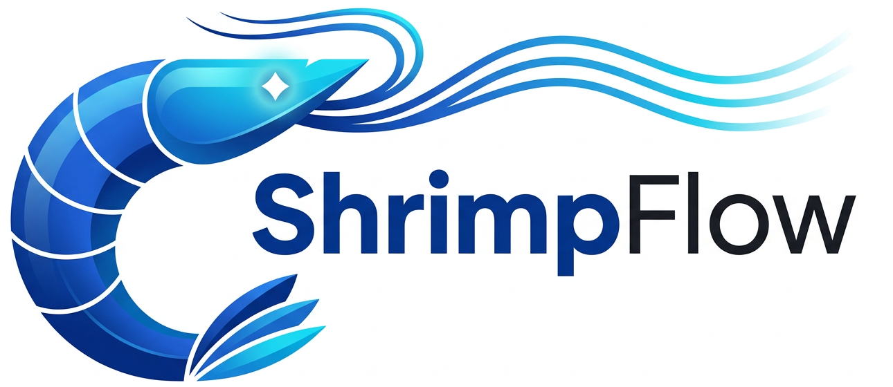

<p align="center">
  <br/>
  
  <br/><br/>
  <em>程序员的行为记忆与协作驱动系统</em>
  <br/><br/>
  <a href="#工作原理">工作原理</a>&nbsp;&nbsp;·&nbsp;&nbsp;<a href="#四层架构">架构</a>&nbsp;&nbsp;·&nbsp;&nbsp;<a href="#clawprofile">ClawProfile</a>&nbsp;&nbsp;·&nbsp;&nbsp;<a href="#案例omnistack">案例</a>&nbsp;&nbsp;·&nbsp;&nbsp;<a href="#安全与隐私">安全</a>&nbsp;&nbsp;·&nbsp;&nbsp;<a href="#技术栈">技术栈</a>&nbsp;&nbsp;·&nbsp;&nbsp;<a href="ShrimpFlow.pdf">论文</a>
  <br/><br/>
</p>

> **AI 编程助手最大的问题不是不够聪明，而是不够了解你。**
>
> 每次对话结束，上下文随即消失。AI 不记得你昨天解决过什么问题，不了解你偏好的代码风格，也不知道你积累了哪些技术判断。每一次协作都从零开始。
>
> ShrimpFlow 只做一件事——**让 AI 记住你是怎么工作的。**

---

## 工作原理

```
你写代码  ──▶  ShrimpFlow 静默观察  ──▶  提取行为模式  ──▶  AI 按你的习惯协作
```

不需要手动写规则，不需要整理文档。你正常工作，ShrimpFlow 从终端命令、Git 提交、AI 对话中自动学习，生成一份叫做 **ClawProfile** 的行为模型，注入 AI 助手的协作上下文。

**用得越久，AI 越懂你。**

## 四层架构

<table>
<thead>
  <tr>
    <th width="140" align="center">层</th>
    <th>说明</th>
  </tr>
</thead>
<tbody>
  <tr>
    <td align="center"><strong>Shadow</strong><br/><sub>静默观察</sub></td>
    <td>后台采集终端命令、Git 操作、AI 对话和环境变化。通过 zsh / git hook 接入，零侵入，异步写入延迟 &lt; 2ms。</td>
  </tr>
  <tr>
    <td align="center"><strong>Mirror</strong><br/><sub>映射画像</sub></td>
    <td>将原始事件转化为可视化画像——开发时间线、技能图谱、自动日报与周报。即使不使用后续层，Mirror 本身就是一面审视工作方式的镜子。</td>
  </tr>
  <tr>
    <td align="center"><strong>Brain</strong><br/><sub>提炼模式</sub></td>
    <td>语义归纳 + 规则匹配，从历史数据中提取稳定行为模式，构建 ClawProfile。每条模式附带置信度分数，随新数据持续更新，长期不出现则自动衰减。</td>
  </tr>
  <tr>
    <td align="center"><strong>Autopilot</strong><br/><sub>驱动协作</sub></td>
    <td>按当前任务上下文，从 ClawProfile 中选取最相关的模式子集注入 AI。三个级别：<strong>建议 → 半自动 → 全自动</strong>，随时切换，开发者始终拥有控制权。</td>
  </tr>
</tbody>
</table>

## ClawProfile

ClawProfile 是 ShrimpFlow 的核心产物——从你的真实行为中自动提取的结构化行为模型。

<table>
<tbody>
  <tr>
    <td width="80"><strong>模式</strong></td>
    <td>每次新建模块前先写测试骨架</td>
  </tr>
  <tr>
    <td><strong>场景</strong></td>
    <td>创建新功能模块时触发</td>
  </tr>
  <tr>
    <td><strong>证据</strong></td>
    <td>iter-16 commit <code>abc1234</code>、iter-18 commit <code>f7e2910</code>、…</td>
  </tr>
  <tr>
    <td><strong>置信度</strong></td>
    <td>0.92（观察 14 次）</td>
  </tr>
</tbody>
</table>

<br/>

**和现有方案有什么不同？**

| 维度 | 对话历史 | 规则文件 | 统计工具 | **ShrimpFlow** |
|:--|:--|:--|:--|:--|
| **记住的是** | 你说过什么 | 你写下了什么 | 做了多少 | **你实际怎么做的** |
| **维护方式** | 自动但非结构化 | 手动编写 | 自动 | **自动提取 + 结构化** |
| **驱动 AI** | 检索质量受限 | 静态，不随习惯演化 | 无法驱动 | **按任务上下文选择性注入** |

ClawProfile 支持**打包与分享**。导入一份资深工程师的 Profile，AI 立刻按其习惯工作——个人开发经验成为可传递、可组合的结构化资产。

## 案例：OmniStack

在机器人全栈系统 OmniStack 的开发中，AI Agent 基于 ClawProfile 独立完成了 32 轮迭代（约 46 小时），**全程零人工代码修改**。

<table>
<thead>
  <tr>
    <th align="center" width="25%">118</th>
    <th align="center" width="25%">16,824</th>
    <th align="center" width="25%">704</th>
    <th align="center" width="25%">0</th>
  </tr>
</thead>
<tbody>
  <tr>
    <td align="center"><sub>Git 提交</sub></td>
    <td align="center"><sub>行核心代码</sub></td>
    <td align="center"><sub>测试用例</sub></td>
    <td align="center"><sub>人工代码修改</sub></td>
  </tr>
</tbody>
</table>

<br/>

**行为从无序到收敛的过程：**

| 阶段 | 表现 | 格式匹配率 |
|:--|:--|--:|
| iter 8 – 12 | 粗粒度提交，功能·测试·文档混在一起 | **0%** |
| iter 13 – 15 | 开始按模块拆分 scope，节奏尚不稳定 | ~50% |
| iter 16 – 32 | 严格 `feat → test → docs` 三合一节奏，无一例外 | **100%** |

这些格式不是预设的模板，而是 Brain 层从开发者的历史行为中归纳出的模式——Agent 学会了之后自主遵守。

Agent 还展现了模式之外的工程判断力：自主修复 LoRA checkpoint 序列化缺陷、清理 38 个 lint 错误、将 15 个按迭代编号组织的测试文件重组为 6 个按功能域组织的文件。这些决定不是开发者发起的，而是 Agent 自行评估项目状态后做出的。

## 安全与隐私

| 原则 | 措施 |
|:--|:--|
| **本地优先** | 所有行为数据写入本地 SQLite，不经过任何外部服务器 |
| **自动脱敏** | 写入前识别并脱敏敏感信息；调用 LLM 前移除代码实体细节，仅保留行为结构描述 |
| **用户控制** | 每条模式可查看、修改、删除；ClawProfile 分享范围由用户决定，默认不公开 |
| **最小采集** | 仅采集开发活动相关数据，不监控其他应用 |

## 技术栈

| 模块 | 选型 | 理由 |
|:--|:--|:--|
| Shadow | zsh hooks · git hooks | 利用已有 hook 机制，插件式架构，零侵入 |
| 存储 | SQLite (WAL) | 单文件、并发安全、数据完全本地 |
| Brain | LLM API + 规则引擎 | 语义归纳发现模式，规则引擎验证稳定性 |
| Mirror | Vue 3 · D3.js · Three.js | 2D/3D 交互式可视化 |
| Autopilot | Prompt Injection | 根据任务上下文选择性注入，避免提示过载 |

---

<p align="center">
  <sub>Built by <strong>AudaxLab</strong> · Copyright © 2026</sub>
</p>
